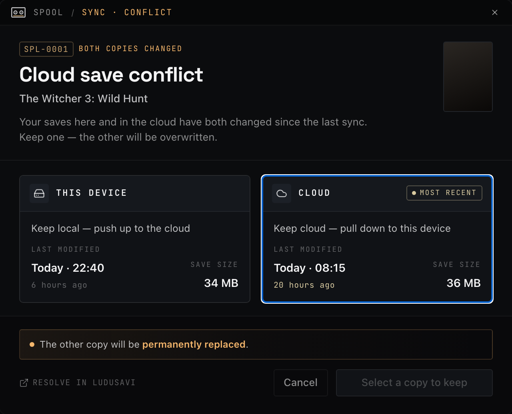

<p align="center">
  
</p>

<h1 align="center">Spool</h1>

<p align="center">
  A game library that keeps your saves in sync between your Steam Deck and your PC.
</p>

<!-- spool:shot id=library-desktop -->

<!-- spool:endshot -->

---

Spool is a game library and launcher for Windows and Linux handhelds. It launches
your games, and for each session it will restore your saves before play and back
them up on exit. It uses [ludusavi](https://github.com/mtkennerly/ludusavi) under
the hood. The point is to make moving between a desktop and a Steam Deck painless:
your saves follow you, and you can copy game installs straight across your network.

## What it's good at

### Reliable save sync between Steam Deck and PC

Spool wraps [ludusavi](https://github.com/mtkennerly/ludusavi) to back up and
restore saves automatically around every play session, and syncs those backups
through any cloud remote ([rclone](https://rclone.org/) is bundled — Google Drive,
Dropbox, OneDrive, WebDAV, and more). The freshest save is pulled before launch and
pushed after you quit, so you can stop on the Deck and pick up on the PC without
overwriting yourself. If both sides changed, Spool shows a conflict picker instead
of guessing.

<!-- spool:shot id=cloud-conflict -->

<!-- spool:endshot -->


### LAN transfers between devices

Copy game installs directly between machines on your network — no internet, no
re-downloading from the store. Enable LAN sharing and your devices find each other
automatically; a peer's games show up in your library, and you pick one to transfer.
This makes getting a game onto the Steam Deck much faster than downloading it again.
Transfers verify every file, resume if interrupted, and add the game to your library
automatically when done.

<!-- spool:shot id=transfers -->

<!-- spool:endshot -->


### Decky plugin for Game Mode

A companion [Decky Loader](https://github.com/SteamDeckHomebrew/decky-loader)
plugin lets you manage your Spool games directly in SteamOS Game Mode, so you
don't have to drop to Desktop Mode. From the Quick Access menu you add any Spool
game to Steam with a tap — from then on each game's Spool details live right on
its own Steam game page: cross-device playtime, last played, and the save-backup
and cloud-sync status, plus a menu to back up now, install Windows dependencies
(Proton), or delete the game. You can also browse and install games shared by
other Spool devices on your LAN. And it backs up your saves if Steam force-closes
Spool when you quit a game, so a session is never lost. Install it in one click
from Spool's settings.


## Download

Grab the latest build from the [Releases](../../releases) page:

* **Windows** — the `Spool_<version>_x64-setup.exe` installer.
* **Linux** — the `Spool_amd64.AppImage`.

Both platforms auto-update in place.

On Linux, to drop the AppImage into `~/Applications` and add a launcher entry
(with icon) so it shows up in your desktop's app menu — KDE Plasma, GNOME, etc.:

```bash
curl -fsSL https://raw.githubusercontent.com/aidankinzett/Spool/master/scripts/install-appimage.sh | bash
```

The same script lives at [`scripts/install-appimage.sh`](scripts/install-appimage.sh);
run it with `--uninstall` to remove the AppImage and launcher entry.

## Platform support

Spool runs on **Windows** and **Linux**, including the gaming-handheld distros
(Bazzite, CachyOS, SteamOS / Steam Deck). The library, save sync, LAN sharing, and
cloud sync work on both. A few extras are platform-specific: the Linux build runs
Windows `.exe` games through **Proton** and adds the SteamOS Game-Mode splash and
Decky plugin; the Windows build adds run-as-administrator and Armoury Crate launcher
generation.

## Documentation

User guides, the full feature list, the Decky plugin docs, and developer/architecture
documentation live at **[the Spool docs site](https://spool.kinzett.io/)**.
New here? Start with [Install Spool](https://spool.kinzett.io/guides/installing/).
To build from source, see [Getting Started](https://spool.kinzett.io/guides/getting-started/).

Spool is built with [Tauri 2](https://v2.tauri.app/) (Rust) and
[SvelteKit 5](https://kit.svelte.dev/). Saves themselves are handled by
[ludusavi](https://github.com/mtkennerly/ludusavi).

## License

See [LICENSE](LICENSE).
</content>
</invoke>
