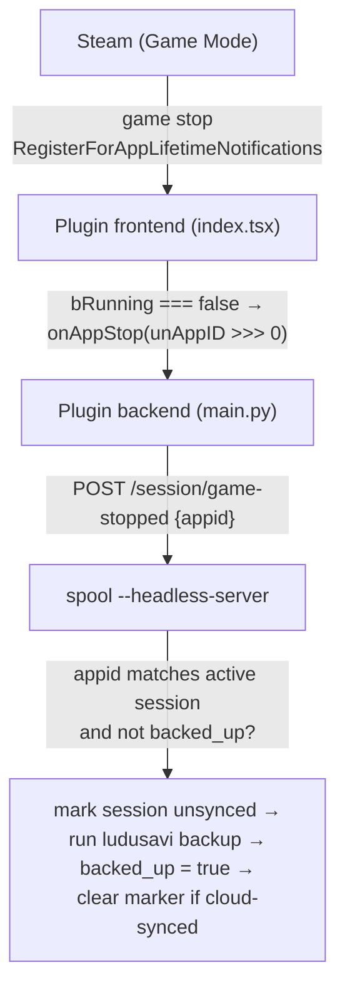

This is the plugin's original purpose: making sure a game's saves get backed up even when Steam force-closes Spool.

## The problem

On SteamOS Game Mode, when you close a game via **Quick Access → Exit Game**, Steam `SIGKILL`s the tracked process tree. The process Steam tracks is Spool's attached `spool --run` instance (see [Game Mode launch](../architecture/game-mode)), so Spool can be killed **before** its post-session ludusavi backup runs. That session's saves never reach the backup, and the unsynced-session marker that warns other devices is never cleared.

Any backup runner inside Steam's killed tree races the `SIGKILL`. The fix is to trigger the backup from a process that **survives** the close. The Decky plugin's backend runs in the Decky service context — outside the game's process tree — so the work it starts survives the force-close.

## The session record

The attached `--run` workflow writes `~/.local/share/Spool/active-session.json` at launch (`session.rs`):

| Field | Meaning |
|-------|---------|
| `game` | Library game name |
| `steam_appid` | The non-Steam shortcut's CRC appid (`u32`) Steam reports for this launch |
| `session_id` | `<appid>-<started_at_millis>` — identifies this specific session |
| `started_at` | RFC 3339 launch time |
| `backed_up` | Flipped to `true` once a backup completes |

`steam_appid` is computed the same way Steam computes a non-Steam shortcut's appid — a CRC over the quoted exe path and the game name (`session::compute_steam_appid`) — so it matches what Steam later reports on the stop event.

## The flow

1. **Frontend** registers `SteamClient.GameSessions.RegisterForAppLifetimeNotifications` **once at plugin load** (in the `definePlugin` factory body, not inside the QAM panel, which unmounts when the panel closes). On a stop (`bRunning === false`) it calls the `on_app_stop` callable.

   Steam surfaces Spool's non-Steam shortcut appids — `crc32(...) | 0x80000000`, high bit set — through `unAppID` as a **signed** int32 (e.g. `-105595925` instead of `4189371371`). The frontend coerces it back to unsigned with `>>> 0` before sending, so it matches the unsigned `steam_appid` in the session record.

2. **Backend** (`main.py::on_app_stop`) forwards the appid to the headless server: `POST /session/game-stopped {appid}` (120 s timeout). It does no matching itself — the server owns that.

3. **Headless server** (`plugin_server.rs::post_game_stopped`) reads the session record:
   - If there's no record, or `backed_up` is already `true`, or `steam_appid != appid` → it no-ops and returns `{ "acted": false }`. Non-Spool games and already-backed-up sessions cost nothing.
   - Otherwise it flags this device's session as **unsynced** in the rclone control plane first (`rclone::mark_session_pending_backup_from_config`) — independent of the backup result, so peers immediately see that this device has saves not yet in the cloud — then runs the backup via `runner::backup_game_core`.

4. On a successful backup the server marks the session `backed_up` (only if the `session_id` still matches, guarding against a new game starting while the async backup was in flight) and clears the unsynced-session marker **only if the saves actually reached the cloud** (`r.cloud_synced`). If the upload failed or hit a conflict the marker is left in place so peers keep warning until a real sync happens — a flaky Deck Wi-Fi must not silently drop the "unsynced session" signal.

## Double-backup avoidance

The `backed_up` flag is what keeps a normal quit from double-backing-up:

- **Normal in-game quit**: the attached `spool --run` backs up, sets `backed_up: true`, and exits — *then* Steam fires the stop event. By the time the server processes the game-stopped request the flag is already `true`, so it no-ops.
- **Forced "Exit Game"**: Spool is `SIGKILL`ed before flipping the flag, so the record stays `false` and the server runs the fallback backup.

## Notifications

After a game-stop the backend re-reads its settings; if `notify` is on (default) and the server reported `acted: true`, it emits a `spool_backup_finished` event with the game name, success flag, and reason. The frontend listens for that event and shows a toast — `Backed up <game> ✓` or `Backup failed: <reason>`.

## Manual backup

The QAM panel's **Back up now** button calls the `backup_now` callable → `POST /session/backup-now`. Unlike the game-stop path, this does no appid check and backs up whatever game the current session record points at. It's disabled when there's no active session.
