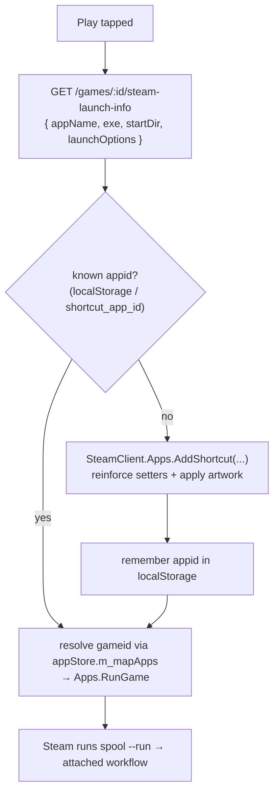

Beyond the backup safety net, the plugin renders a full-screen library you can browse and launch from in Game Mode. The QAM panel's **Browse Library** button navigates to it.

## Routes

The frontend registers its pages through Decky's `routerHook` at plugin load (`src/index.tsx`), using the constants in `src/constants.ts`:

| Constant | Path | Page |
|----------|------|------|
| `SPOOL_ROUTE` | `/spool` (exact) | `SpoolPage` — library grid + LAN button |
| `SPOOL_GAME_ROUTE` | `/spool/game/:id` | `GameDetailPage` |
| `SPOOL_LAN_ROUTE` | `/spool/lan` (exact) | `LanPage` — see [LAN browsing](./lan-browsing) |
| `SPOOL_LAN_PEER_ROUTE` | `/spool/lan/:peerAddr/:peerPort` (exact) | `PeerGamesPage` |
| `SPOOL_LAN_GAME_ROUTE` | `/spool/lan-game/:peerAddr/:peerPort/:gameId` | `PeerGameDetailPage` |

`/spool` is registered `exact` because otherwise it prefix-matches `/spool/game/:id` and shadows the detail page — the first matching `<Route>` in the Switch wins. Each page is its own route (rather than nested state) so the hardware **B** button walks the back-stack naturally: a peer's game list backs out to the peers list, which backs out to the library.

All pages resolve the headless server base URL once via the `useServerBase()` hook (which calls the `get_server_base` callable) and talk to the server directly over loopback HTTP.

## Library grid

`LibraryGrid` fetches `GET ${base}/library` and renders a `CoverGrid` of tiles. Covers load by URL from `${base}/covers/<filename>` (the filename is taken from each entry's `cover_image_path`). It shows *"Loading…"*, *"Couldn't load your library."*, or *"No games in your library yet."* as appropriate. Activating a tile navigates to `/spool/game/:id`.

`GameDetailPage` re-fetches the library to find the game by id, renders a full-bleed hero background (`GET ${base}/games/:id/steam-art/hero`), the portrait cover, playtime, last-played, and the sync badge, plus a **Play** button that calls `launchLibraryGame`.

## Launching a game

Launching from Game Mode means getting Steam to run the game so it shows up in the running-game UI and the post-session flow works. The plugin does this by creating (or reusing) a **non-Steam shortcut** live via `SteamClient.Apps` — no Steam restart — then asking Steam to run it. This mirrors what desktop "Add to Steam" writes, so a game added either way ends up with the same shortcut. The flow lives in `src/lib/launch.ts` and `src/lib/steam.ts`.

1. **Launch info** — `GET ${base}/games/:id/steam-launch-info` returns the shortcut fields. The `exe` is Spool's stable launcher (`paths::spool_executable` — the `spool-launcher.sh` wrapper on AppImage installs), and `launchOptions` is `--run "<name>" "<game exe>"`, which the Game-Mode attached `--run` flow consumes.

2. **Resolve the appid** — the exe and start-dir are passed to Steam **quoted** (literal surrounding double-quotes), matching how the server computes the shortcut's CRC appid (`steam::compute_shortcut_app_id` CRCs the quoted exe). The plugin reuses an appid from three sources, in order:
   - a per-game appid remembered in `localStorage` (`src/lib/appid-map.ts`, keyed by game id),
   - the server-computed `shortcut_app_id` injected into each `/library` entry (used when localStorage is stale or cleared),
   - otherwise it calls `AddShortcut(appName, quotedExe, quotedStartDir, launchOptions)`, which returns a fresh appid.

   When it adds a new shortcut it reinforces every field via the explicit setters. `SetAppLaunchOptions` is the one that actually sticks — without it the launcher would run with no `--run` args and nothing would launch. It then applies library artwork (best-effort) and remembers the appid.

3. **Run it** — the authoritative `gameid` is read from Steam's in-memory app store (`appStore.m_mapApps.get(appid).m_gameid`, polled briefly until the shortcut registers) rather than computed by hand. The launch then tries `SteamClient.Apps.RunGame`, falling back to `URL.ExecuteSteamURL("steam://rungameid/…")`, then `Navigation.Navigate`.

Steam then runs `spool --run "<name>" "<exe>"`, which triggers Spool's existing attached-launch workflow (restore → play → backup) and writes the session record the [forced-close safety net](./forced-close-backup) depends on.

### Matching a Steam appid back to a Spool game

`findSpoolGame` (used by the launch flow and the [playtime badge](./playtime-badge)) maps a Steam appid to a library entry by checking, in order: a matching `steam_id` (a native Steam game Spool also tracks), a matching `shortcut_app_id` (a shortcut created server-side), then the `localStorage` inverse map (a shortcut created live via the plugin).

### Artwork

`applyArtwork` (`src/lib/steam.ts`) pulls four art kinds from the server and sets them live via `SetCustomArtworkForApp`, mapping each to Steam's `ELibraryAssetType`: `capsule` (portrait, 0), `hero` (banner, 1), `logo` (transparent title, 2), `header` (wide capsule, 3). Server-side (`get_steam_art`), portrait and hero come straight off Spool's on-disk art (so they work even with SteamGridDB disabled); `logo` and the wide `header` are fetched live from SteamGridDB (`header` → SteamGridDB's landscape `grid`). WebP images are transcoded to PNG because `SetCustomArtworkForApp` rejects WebP. Any kind that 404s is silently skipped, and art failures never block the launch.
