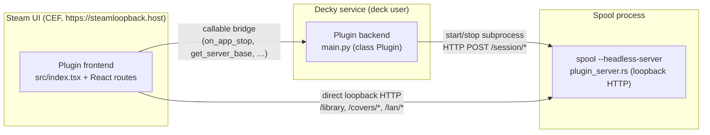

Spool ships a companion **Decky Loader** plugin for SteamOS / Steam Deck **Game Mode**. It lives in `decky/` in the repo and is a separate sub-project from the Tauri app (its own `package.json`, build, and CI). The source is embedded into the Spool binary so the app can install it for you — see [Installation & build](./installation).

The plugin does three things in Game Mode, where the desktop Spool window isn't reachable:

1. **Forced-close backup safety net** — backs up a game's saves when Steam kills Spool before its post-session backup runs (the plugin's original purpose). See [Forced-close backup](./forced-close-backup).
2. **A full-screen library + LAN browser** — browse your Spool library, launch games, and download games from LAN peers, all from the Quick Access Menu. See [Library & launching](./library-and-launch) and [LAN browsing](./lan-browsing).
3. **A cross-device playtime badge** — injects Spool's playtime and last-played onto Steam's own game pages. See [Playtime badge](./playtime-badge).

## The three processes

A Decky plugin has a Python backend (runs in the Decky service context) and a frontend (runs in Steam's UI / CEF context). Spool's plugin is a thin adapter over a third process — `spool --headless-server`, a loopback HTTP server inside the main Spool process that owns all the real logic (backups, session state, library, LAN, art).

- The **backend** (`main.py`) manages the headless server's lifetime — starts it on plugin load, kills it on unload — and forwards game-stop events to it. It also hands the frontend the server's base URL.
- The **frontend** (`src/index.tsx` + React components) renders the Quick Access Menu (QAM) panel and the full-screen routed pages. For everything except the game-stop hook and settings, it talks to the headless server **directly** over `http://127.0.0.1:<port>` rather than routing through the Decky callable bridge — see [Headless server](./headless-server) for why.

## Where the logic lives

The plugin itself is deliberately thin. Backups, session matching, the library, cross-device folds, LAN proxying, and Steam art transcoding all live in Spool's Rust headless server (`tauri/src-tauri/src/plugin_server.rs`). The plugin starts that server, forwards events to it, and renders its responses. This keeps a single source of truth — the server reloads config and library from disk on every request, so changes made in the desktop Spool GUI are visible to the plugin without a restart.

## Privilege: runs as the `deck` user

`plugin.json` declares `"flags": []` — no `_root` — so the backend runs as the `deck` user. Consequences, all intended:

- `decky.HOME` / process `$HOME` is the deck user's home, so paths resolve correctly with no `sudo`.
- The `spool --headless-server` subprocess inherits the deck user's environment (`HOME`, `XDG_DATA_HOME`, the user D-Bus session), so ludusavi reads and writes the same save and backup paths Spool uses interactively, with correct file ownership.

## See also

- [SteamOS Game Mode Launch](../architecture/game-mode) — the Spool-side session record and attached `--run` contract this plugin consumes.
- [Save mapping](../architecture/save-mapping) and [Ludusavi integration](../architecture/ludusavi) — what the backup the plugin triggers actually does.
