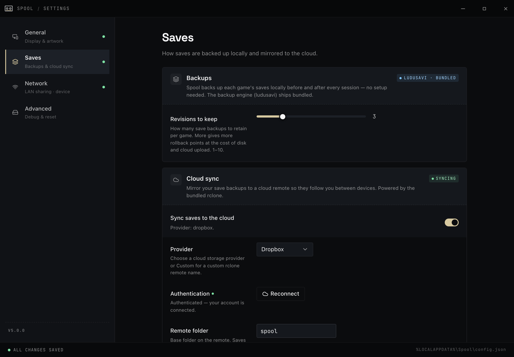

Spool backs up and restores your saves around every play session using
[ludusavi](https://github.com/mtkennerly/ludusavi), and syncs those backups
through a cloud remote with the bundled [rclone](https://rclone.org/). The
freshest save is pulled before launch and pushed after you quit, so you can stop
on the Deck and pick up on the PC without overwriting yourself.

## How a session works

Each time you launch a game from Spool:

1. **Restore** — Spool pulls the latest backup from the cloud and restores it, so
   you start from your most recent save.
2. **Play** — the game runs.
3. **Back up** — when you quit, Spool captures the saves and uploads them to the
   cloud.

If the cloud copy is simply newer than your local one, Spool fast-forwards to it
silently. If *both* sides changed since the last sync — a genuine conflict — Spool
stops and shows a conflict picker so you choose which save to keep, rather than
guessing.

## Set up a cloud remote

Open **Settings → Saves**. Spool supports Dropbox, Google Drive, OneDrive, Box,
FTP, SMB, WebDAV, or a custom rclone remote.

### Google Drive, Dropbox, OneDrive, Box

These use a browser sign-in:

1. Pick the provider.
2. Click connect — Spool opens your browser to authorize access.
3. Approve the request and return to Spool. It stores the connection and is ready
   to sync.

For Google Drive, Spool requests only the access it needs to manage its own
backup folder — it can't see the rest of your Drive.

### WebDAV, FTP, SMB, or a custom remote

Choose the type and fill in the connection details (URL, username, and so on).
These don't need a browser sign-in.

### Base folder

Saves are stored under a base folder on the remote that you can set in Settings.
Spool keeps your save backups in `<base>/ludusavi-backup` and a small amount of
its own coordination data in `<base>/_spool`.

## Using it across devices

Configure the **same remote and base folder** on each device. With that in place:

- Playtime, last-played, and the "saves backed up" badge are pooled across all
  your devices.
- If another device still has a session whose saves haven't reached the cloud
  yet, Spool warns you before launching the same game — with a "play here anyway"
  override — so two devices don't fork the same save.

## If the remote is unreachable

Spool checks the remote's reachability and surfaces the status in the app. A
cloud probe that can't connect fails quickly rather than hanging a launch, so an
offline remote won't block you from playing.
