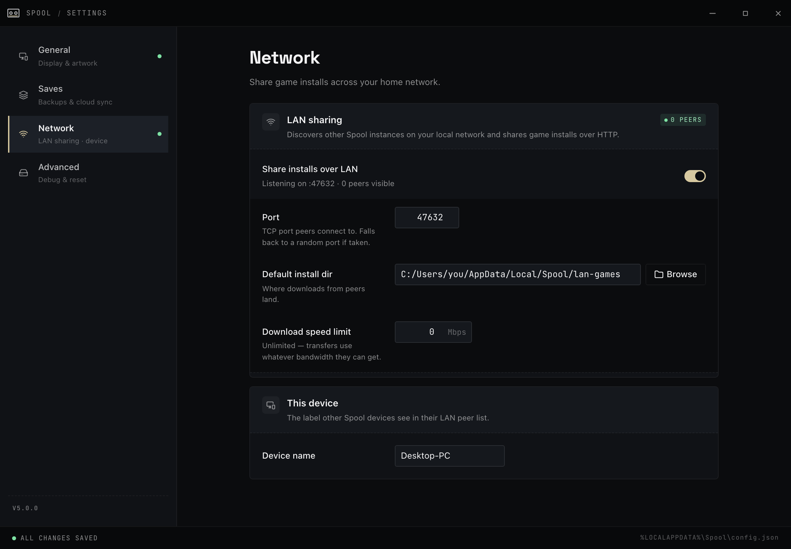
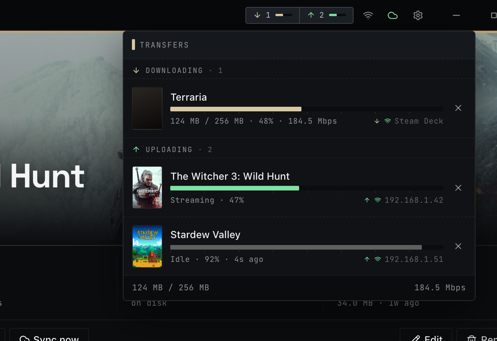

Spool can copy game installs directly between machines on your network — no
internet, no re-downloading from the store. This makes getting a game onto a
Steam Deck much faster than downloading it again.

## Enable sharing

On the device that already has the game, open **Settings → Network** and turn on
**LAN sharing**. You can also set:

- A **device name** so peers recognise this machine.
- The **install folder** where games received from peers are saved.
- An optional **download speed cap** if you don't want transfers saturating your
  connection.

Devices with sharing enabled find each other automatically on the same network —
there's nothing to pair.

## Transfer a game

1. On the receiving device, open the **LAN** view. Games shared by peers on the
   network appear there.
2. Pick a game to bring over.
3. Watch the transfer progress. When it finishes, the game is added to your
   library automatically and is ready to launch.

## What makes it safe to retry

- **Every file is verified.** The sender hashes each file; the receiver checks the
  hash as it downloads, so a corrupted transfer is caught.
- **Interrupted transfers resume.** Files download into a temporary folder and are
  only moved into place once the whole game has arrived intact — so if a transfer
  is interrupted, starting it again picks up where it left off instead of starting
  over.

## Saves still come from the cloud

LAN transfer copies the game *install*, not your saves. Your save sync continues
to work as usual — see [Cloud Save Sync](/guides/cloud-saves/). So you can pull a
game onto the Deck over LAN and still have your latest save restored on first
launch.
