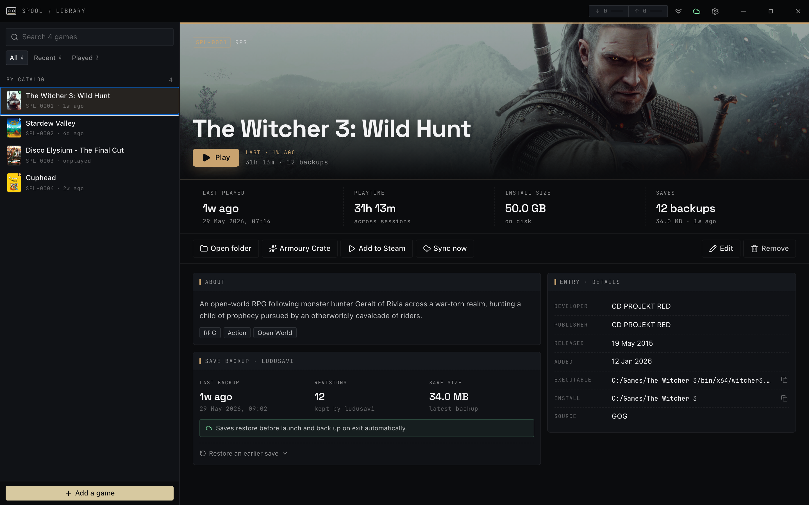

import { Card, CardGrid } from '@astrojs/starlight/components';

Spool launches your games and, for each session, restores your saves before play
and backs them up on exit. Moving between a desktop and a Steam Deck is painless:
your saves follow you, and you can copy game installs straight across your network.

<CardGrid>
	<Card title="Save sync between Deck and PC" icon="cloud-download">
		Saves are backed up around every session and synced through any cloud
		remote (Google Drive, Dropbox, OneDrive, WebDAV, and more). Stop on the
		Deck, pick up on the PC. If both sides changed, Spool shows a conflict
		picker instead of guessing.
		[Set up cloud saves →](/guides/cloud-saves/)
	</Card>
	<Card title="LAN transfers" icon="laptop">
		Copy game installs directly between machines on your network — no
		internet, no re-downloading from the store. Transfers verify every file
		and resume if interrupted.
		[Transfer over LAN →](/guides/lan-transfers/)
	</Card>
	<Card title="Steam Deck Game Mode" icon="puzzle">
		A companion Decky Loader plugin brings your library, LAN transfers, and
		cross-device playtime into SteamOS Game Mode — no Desktop Mode needed.
		[Decky plugin →](/decky/overview/)
	</Card>
	<Card title="Windows + Linux" icon="open-book">
		Runs on Windows and Linux handhelds (Bazzite, CachyOS, SteamOS). The
		Linux build runs Windows `.exe` games through Proton.
		[Install Spool →](/guides/installing/)
	</Card>
</CardGrid>

## Building from source?

Developer and architecture documentation sits further down the sidebar. Start
with [Getting Started](/guides/getting-started/) to build and run the app, then
read the [Architecture overview](/architecture/overview/) for the module map.
